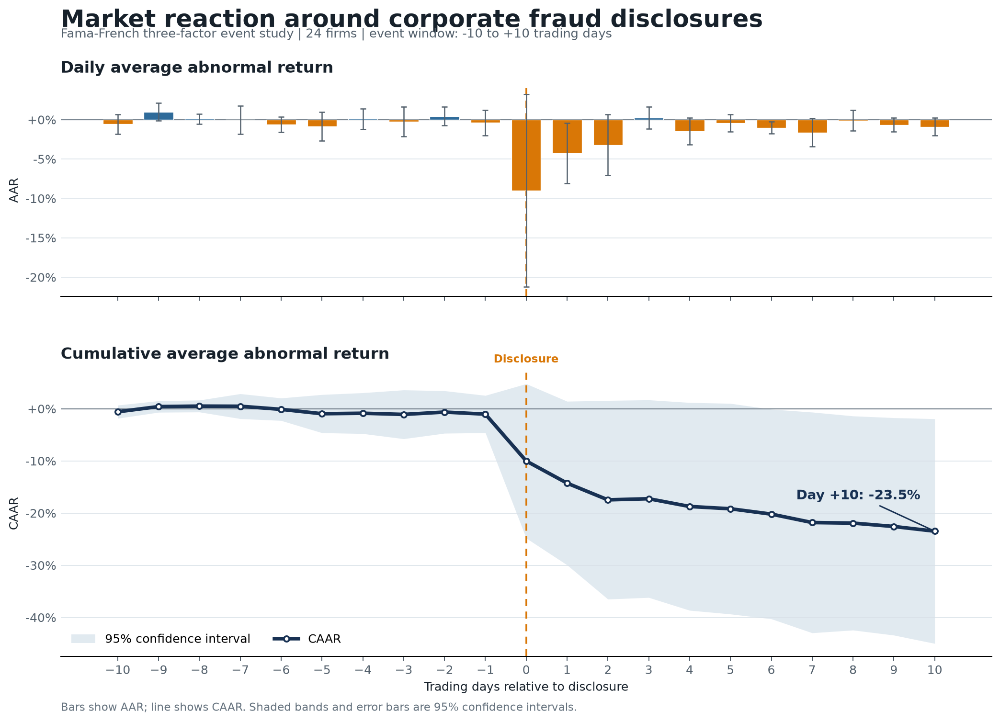

# Market Reaction to Corporate Fraud Disclosures

An event study measuring abnormal stock returns around 25 confirmed corporate fraud disclosure dates using the **Fama-French Three-Factor Model**. The current reproducible run includes 24 firms; Yahoo Finance no longer returns the delisted GOEV series.



---

## Key Results

| Metric | Value |
|---|---|
| CAAR by Day +10 | -23.5% |
| Significant AAR days (p < 0.05) | Day +1, Day +6 |
| Usable sample | 24 of 25 events, 2015-2022 |
| Model | Fama-French 3-Factor (OLS) |

The sample shows economically meaningful negative abnormal returns following disclosure. The continued negative drift through Day +10 is consistent with investors reassessing firm risk, legal exposure, and credibility after the initial announcement.

Results are robust to:
- Winsorization of extreme returns
- Outlier exclusion (Luckin Coffee)
- Alternative event windows ([-5, +5] and [-1, +1])
- Single-factor CAPM specification

---

## Quick Start

```bash
pip install -r requirements.txt
# or
make setup
```

Regenerate the complete analysis and all figures from the command line:

```bash
python scripts/generate_results.py
```

For the step-by-step analysis, open `notebooks/event_study_analysis.ipynb`.

---

## Project Structure

```
├── README.md
├── requirements.txt
├── Makefile
├── LICENSE
├── data/
│   ├── README.md
│   └── Fraud_events.csv
├── src/
│   ├── __init__.py
│   └── event_study.py          # Core logic: estimation, AR calc, stats, plots
├── notebooks/
│   └── event_study_analysis.ipynb  # Analysis narrative + results
├── scripts/
│   └── generate_results.py        # Rebuild tables and figures
└── output/                     # Generated tables + committed README figures
    ├── *.csv
    └── figures/*.png
```

---

## Methodology

1. **Estimation window** (Day −150 to −30): Estimate factor loadings via OLS regression of excess returns on Mkt-RF, SMB, and HML.
2. **Event window** (Day −10 to +10): Compute abnormal returns as actual minus expected returns.
3. **Cross-sectional tests**: Parametric t-tests, Wilcoxon signed-rank, and binomial sign tests. Benjamini–Hochberg correction for multiple comparisons.

$$AR_{i,t} = (R_{i,t} - R_f) - \hat{\alpha}_i - \hat{\beta}_1 (R_m - R_f) - \hat{\beta}_2 \text{SMB} - \hat{\beta}_3 \text{HML}$$

---

## Data Sources

- **Fraud events**: Manually curated from SEC enforcement actions, DOJ settlements, whistleblower reports, and investigative journalism
- **Stock prices**: Yahoo Finance (via `yfinance`)
- **Risk factors**: Kenneth French Data Library (via `pandas_datareader`)

---

## Limitations

- Sample limited to 25 high-profile cases, with 24 usable price histories in the current run
- Fama-French model excludes momentum and industry factors
- Some disclosures may coincide with other firm-specific news
- CAAR significance is marginal for longer windows

---

## References

- Fama, E.F. & French, K.R. (1993). Common risk factors in the returns on stocks and bonds. *Journal of Financial Economics*, 33(1), 3–56.
- MacKinlay, A.C. (1997). Event studies in economics and finance. *Journal of Economic Literature*, 35(1), 13–39.
- Karpoff, J.M., Lee, D.S. & Martin, G.S. (2008). The cost to firms of cooking the books. *Journal of Financial and Quantitative Analysis*, 43(3), 581–611.
- Dyck, A., Morse, A. & Zingales, L. (2010). Who blows the whistle on corporate fraud? *Journal of Finance*, 65(6), 2213–2253.

---

## License

[MIT](LICENSE)
